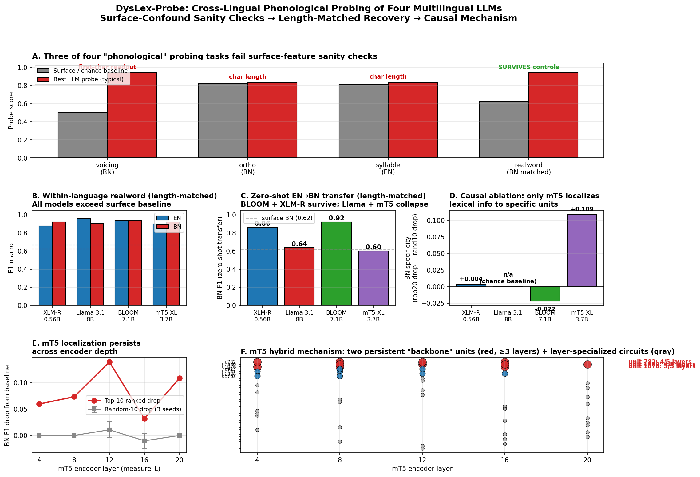

# DysLex-Probe

Cross-lingual lexical representation probing for Bangla dyslexia screening using multilingual language models.

This research repository investigates where and how dyslexia-relevant lexical information is represented across English and Bangla. It compares four model families through layer-wise probing, cross-lingual transfer, representational similarity analysis (RSA), causal ablation, and surface-feature sanity checks.



## Research scope

The experiments examine:

1. **Layer-wise lexical probing** - measures where task-relevant information emerges within each model.
2. **English-to-Bangla transfer** - evaluates whether probes trained on English representations generalize to Bangla.
3. **Cross-lingual similarity** - compares English and Bangla representation geometry using RSA.
4. **Causal ablation** - tests whether highly ranked hidden units are necessary for transfer.
5. **Sanity-controlled evaluation** - checks whether apparent linguistic performance can instead be explained by token identity, word length, or other surface features.

## Models

| Model | Architecture | Scale | Bangla coverage |
| --- | --- | ---: | --- |
| XLM-R large | Encoder-only | 0.56B | Explicit multilingual coverage |
| Llama 3.1 8B | Decoder-only | 8B | Limited |
| BLOOM 7B1 | Decoder-only | 7.1B | Explicit multilingual coverage |
| mT5 XL | Encoder-decoder | 3.7B | Explicit multilingual coverage |

## Dataset

The cleaned probing dataset contains **440 stimuli**:

- 220 English samples
- 220 Bangla samples

The repository includes task labels and matched subsets used for probing and controlled real-word versus pseudo-word evaluation.

## Repository structure

```text
Dyslexia_Thesis/
|-- Dyslexia-XLM-R/   # XLM-R experiments, results, and plots
|-- dyslexia-LLM/     # Llama 3.1 experiments, results, and plots
|-- dyslexia-bloom/   # BLOOM experiments, results, and plots
|-- dyslexia-mt5/     # mT5 experiments and four-model comparison
`-- README.md
```

Each model directory contains its notebook, cleaned stimuli, result tables, and generated visualizations. The consolidated four-model analysis is available in:

- [`dyslexia-mt5/comparison_four_models.md`](dyslexia-mt5/comparison_four_models.md)
- [`dyslexia-mt5/comparison_four_models.xlsx`](dyslexia-mt5/comparison_four_models.xlsx)

## Headline findings

- Surface-feature checks invalidate three initially promising probing tasks: voicing, orthographic similarity, and syllable count.
- Length-controlled real-word versus pseudo-word discrimination remains robust across all four models.
- BLOOM records the strongest controlled English-to-Bangla transfer, while XLM-R provides the strongest parameter efficiency.
- mT5 shows the clearest localized causal mechanism, including a small persistent set of influential encoder units.
- Multilingual pretraining coverage appears more important than model scale for controlled cross-lingual transfer in this evaluation.

These findings should be interpreted with the limitations documented in the consolidated report, including small matched subsets, label confounds in the original voicing task, and architectural differences between the evaluated models.

## Reproducing the experiments

The main entry points are the `main.ipynb` notebooks inside each model directory. Run a notebook from its corresponding directory so that relative dataset and output paths resolve correctly.

The experiments use Python-based scientific and NLP tooling, including PyTorch, Transformers, pandas, NumPy, scikit-learn, SciPy, and Matplotlib. Model weights and generated hidden representations are intentionally excluded from version control.

> A pinned environment or requirements file is not currently included. Recreate the environment appropriate for the selected model before running the notebooks.

## Outputs

The repository tracks:

- Per-layer probing scores
- English-to-Bangla transfer results
- RSA measurements
- Ablation and degradation results
- Sanity-check and length-matched evaluations
- Publication-ready plots and cross-model comparison tables

## Research use

This repository contains experimental research code and should not be treated as a clinical diagnostic system. Any downstream dyslexia-screening application requires appropriate dataset validation, native-speaker review, clinical oversight, and ethical evaluation.
